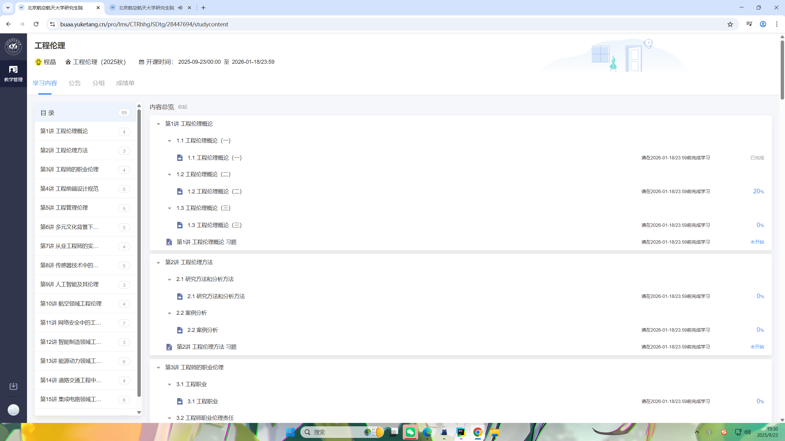

# 雨课堂自动刷课

## 环境配置

```shell
conda env create -f environment.yml
conda activate yuketang
```

## 使用
修改url为对应课程视频列表网址，第一次需要在浏览器中扫码登录

url获取界面如下所示



目前支持新中特、工程伦理、人工智能安全与伦理、矩阵
```shell
python main_new.py # 新中特
python main.py #工程伦理、人工智能安全与伦理、矩阵
```

